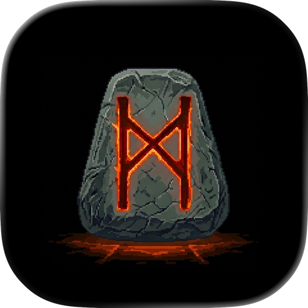
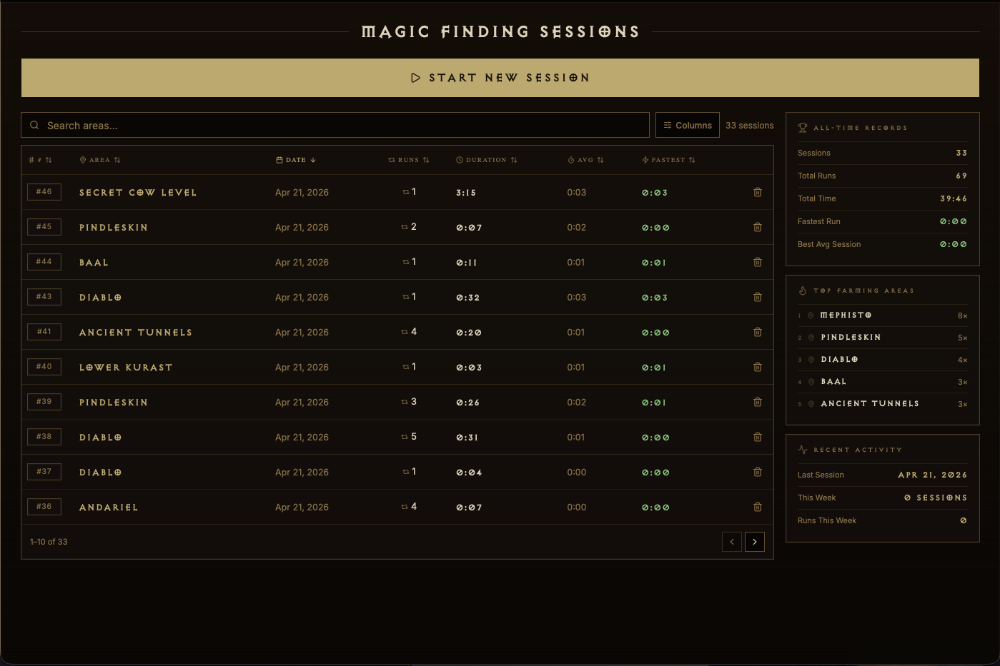

<div align="center">
  
  <h1>D2 MF Tracker</h1>
  <p>A lightweight cross-platform desktop app for manually tracking Diablo 2 magic find sessions.</p>
</div>

----

<div>
  
</div>

## Features

- Sessions and session history
- Manual run tracking with hotkey support

### Hotkeys
#### Super Hotkey: Windows/Linux = `Ctrl`, MacOS = `Command`
- `Super+Shift+S` -> Start/Stop Run
- `Super+Shift+C` -> Cancel Run
- `Super+Shift+E` -> End Session

## Planned Features

- Auto-tracking for offline mode
- In-game overlay

## Releases

The publish workflow creates a draft GitHub release with these assets:

- Windows: unsigned NSIS `.exe` installer
- macOS: unsigned `.dmg` installers for Apple Silicon and Intel
- Linux: signed `.rpm` packages, `.deb`/`.rpm` checksums and detached signatures, plus AUR `PKGBUILD` metadata assets

Unsigned Windows installers will show SmartScreen warnings, and unsigned macOS DMGs may require a manual Gatekeeper bypass on first launch.

### Development

```bash
bun run dev
```
